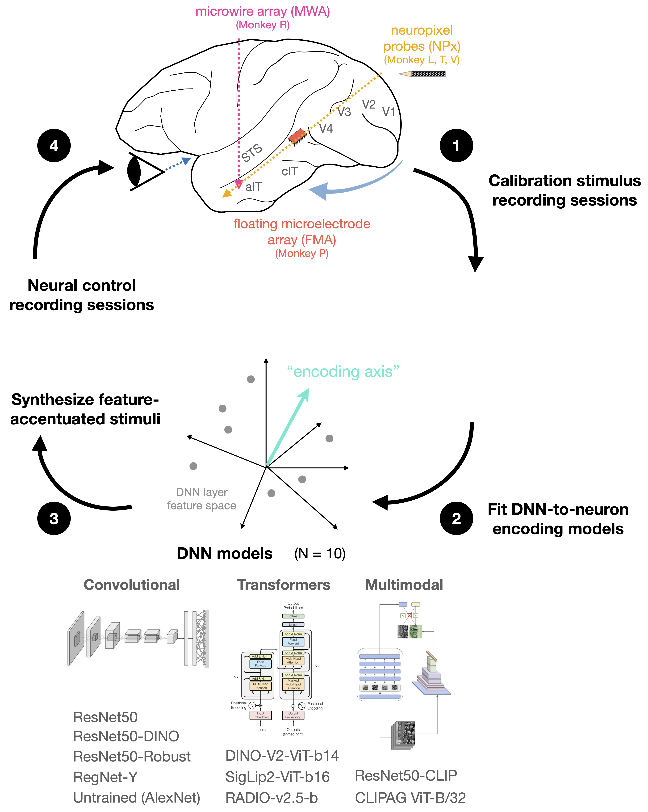
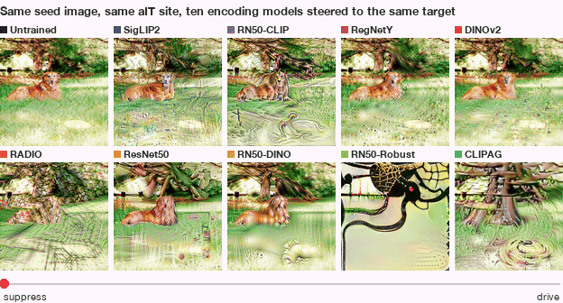
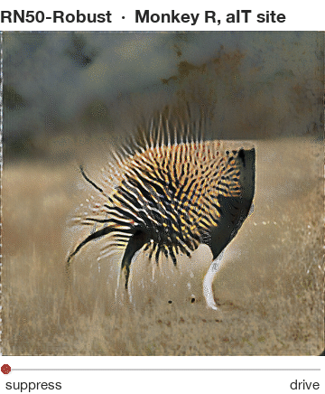

<div align="center">

# Parametric neural control differentiates top neural network models of primate visual cortex

Jacob S. Prince\*, Binxu Wang\*, Thomas Fel, Akshay V. Jagadeesh, Parisa A. Vaziri, George A. Alvarez, Margaret S. Livingstone & Talia Konkle<br>
<sub>Harvard University · Kempner Institute · Harvard Medical School · 2026</sub>

**[📄 Read the preprint on bioRxiv](https://www.biorxiv.org/content/10.64898/2026.08.16.745063v1)**

[](https://www.biorxiv.org/content/10.64898/2026.08.16.745063v1)
[](environment.yml)
[](LICENSE)
[](#-data)
[](notebooks)



</div>

Ten deep networks were each fitted to the same neurons in five macaques, then asked to do something harder than predicting responses to natural images: **synthesize images that push a neuron's firing to a chosen level, up or down, in small steps**. This repository lets you rebuild every figure of the paper, run the full analysis pipeline, and use the method on your own encoding models.

<div align="center">

<br><sub>One seed image, one anterior-IT site, ten encoding models. Each model is steered along its own encoding axis from the lowest to the highest target response. The adversarially trained models (bottom right) produce coherent face-like drivers; most others produce texture.</sub>
</div>

## What's inside

- **Feature accentuation** - gradient-based synthesis that moves a seed image along a fitted encoding axis to hit a target level, in a Fourier-parameterised, augmentation-robust image space (`scripts/synthesis/`, `notebooks/demos/02`).
- **Controversial accentuation** - the same machinery with an objective of the form *model A up, model B down*, so two models disagree maximally about one image (`notebooks/demos/03`).
- **Encoding-model fitting** - layer-wise feature hooks, GPU PCA, ridge regression and the per-site layer-selection rule used in the paper (`core/`, `neural_regress/`, `notebooks/demos/01`).
- **Adversarial sensitivity and gradient spectra** - the two model properties the paper links to control success: how far a small pixel perturbation can move a readout, and how the readout's input gradient is distributed over spatial frequency (`scripts/adversarial/`, `scripts/gradients/`, `notebooks/demos/04-05`).
- **Every figure of the paper** - 6 main + 49 supplementary, as scripts and as step-by-step notebooks that lay each script out with explanations, rendered from the released data (`figures/`, `notebooks/figures/`).

<div align="center">
&nbsp;&nbsp;

<br><sub>Two accentuation sweeps of the robust ResNet-50 for the same aIT site: eleven target levels from suppress to drive.</sub>
</div>

## 🚀 Getting started

```bash
git clone https://github.com/jacob-prince/parametric-neural-control.git
cd parametric-neural-control
conda env create -f environment.yml && conda activate pnc
pip install -e .
python -m ipykernel install --user --name pnc --display-name "Python 3 (pnc)"
```

Fetch the data you need (see [Data](#data)) and render a figure:

```bash
python data/download_data.py --tier preprocessed      # ~0.5 GB: everything the figures read
python figures/render_all.py --only divergence        # -> outputs/figures/divergence.png
python figures/render_all.py                          # all 55 figures
```

Or open the figure's notebook, for example `notebooks/figures/04_divergence.ipynb`: it walks through the script piece by piece (the data it loads, each panel builder, then the assembly of the final figure) with explanations between the cells, and ends with the rendered figure and its caption. Every code cell is a verbatim slice of the script, so what you read is what produced the paper's figure.

## 🔬 Use the method

The demos in `notebooks/demos/` run on a CPU at reduced scale and carry a `FULL_SCALE` switch with the paper's settings:

| notebook | what it does |
|---|---|
| `00_data_tour` | the released recordings, predictions and caches, and the loader API |
| `01_fit_encoding_model` | features → PCA → RidgeCV over candidate layers; the layer-selection rule |
| `02_feature_accentuation` | wrap a fitted readout as a differentiable objective; sweep a seed image to 11 target levels; MACO superstimulus |
| `03_controversial_accentuation` | steer two models apart on one image |
| `04_adversarial_robustness` | PGD swing of the encoding axis, compared with the shipped cluster attacks |
| `05_gradient_spectra` | input-gradient maps, radial Fourier profile, participation ratio |

The core of demo 02, in a few lines:

```python
import numpy as np
from notebooks.demos._demo_utils import EncodingObjective, feature_accentuation, load_image01, stimulus_path

# A fitted encoding model as a differentiable function of the image: backbone -> layer -> PCA -> readout.
obj = EncodingObjective('resnet50_robust', monkey='red', unit=9)

# One of the held-out natural images used as accentuation seeds in the paper.
seed = load_image01(stimulus_path('shared0850_nsd61798.png'), size=256)

# Target levels span the site's natural response range (1st to 99th percentile), extended at both ends.
lo, hi = obj.stats['q01_resp'], obj.stats['q99_resp']
levels = np.linspace(lo - 0.25 * (hi - lo), hi + 0.5 * (hi - lo), 11)

# Each run nudges the seed until the model's predicted response reaches the target (reduced settings here).
sweep = [feature_accentuation(obj, seed, target_level=t, image_size=256, total_steps=300)['image'] for t in levels]
```

`scripts/synthesis/` holds the production synthesiser as we ran it (with GPUs and 6000 steps), `scripts/encoding/` the fitting and layer-selection code, `scripts/adversarial/` and `scripts/gradients/` the analyses behind Figures 5–6. Each folder has a README with inputs, outputs and hardware needs.

## 📦 Data

Two tiers, both on Zenodo (DOI to appear here at publication), downloaded and checksum-verified by one script:

```bash
python data/download_data.py --tier preprocessed   # ~0.5 GB  caches behind every figure
python data/download_data.py --tier source         # ~35 GB   trial-level recordings, model predictions,
                                                   #          stimuli, fitted readouts for the demos
```

The source tier is enough to regenerate the caches from scratch (`python scripts/preprocessing/build_all.py`) and to run every demo. Files land in `source_data/` and `preprocessed_data/`; override with `PNC_SOURCE_DATA` and `PNC_PREPROCESSED_DATA`.

## 🗂 Layout

```
pnc/               study configuration, figure style, cache loader
core/  neural_regress/   model zoo, feature hooks, GPU PCA/SRP, ridge fitting, sklearn -> torch
figures/           main/ and supplementary/ figure scripts, CAPTIONS.md, render_all.py
notebooks/         figures/ (one per figure) and demos/
scripts/           preprocessing, encoding, synthesis, adversarial, gradients, imagenet, embeddings, provenance
data/              download and packaging tools
docs/              REPRODUCIBILITY.md: pixel-exact policy, cache regeneration, tests, Zenodo workflow
```

How the figures are verified against the submitted manuscript, how the caches are rebuilt byte for byte, and what the test suite checks is all in [docs/REPRODUCIBILITY.md](docs/REPRODUCIBILITY.md).

## 📖 Citation

```bibtex
@article{prince2026parametric,
  title   = {Parametric neural control differentiates top neural network models of primate visual cortex},
  author  = {Prince, Jacob S. and Wang, Binxu and Fel, Thomas and Jagadeesh, Akshay V. and Vaziri, Parisa A.
             and Alvarez, George A. and Livingstone, Margaret S. and Konkle, Talia},
  journal = {bioRxiv},
  year    = {2026},
  doi     = {10.64898/2026.08.16.745063},
  url     = {https://www.biorxiv.org/content/10.64898/2026.08.16.745063v1}
}
```

## 🔗 Related

- [Horama](https://github.com/serre-lab/Horama) - the feature-visualisation library the accentuation engine builds on (MACO, Fourier parameterisation)
- [Feature accentuation](https://arxiv.org/abs/2402.10039) (Hamblin et al., 2024) and [MACO](https://arxiv.org/abs/2306.06805) (Fel et al., 2023)
- [circuit_toolkit](https://github.com/PonceLab/circuit_toolkit) - the feature-hook utilities vendored in `core/`

## Authors

Jacob S. Prince (jacob.samuel.prince@gmail.com) and Binxu Wang, with Thomas Fel, Akshay V. Jagadeesh, Parisa A. Vaziri, George A. Alvarez, Margaret S. Livingstone and Talia Konkle. Harvard University, the Kempner Institute and Harvard Medical School.

Code is MIT licensed; third-party notices are in `LICENSE`.
